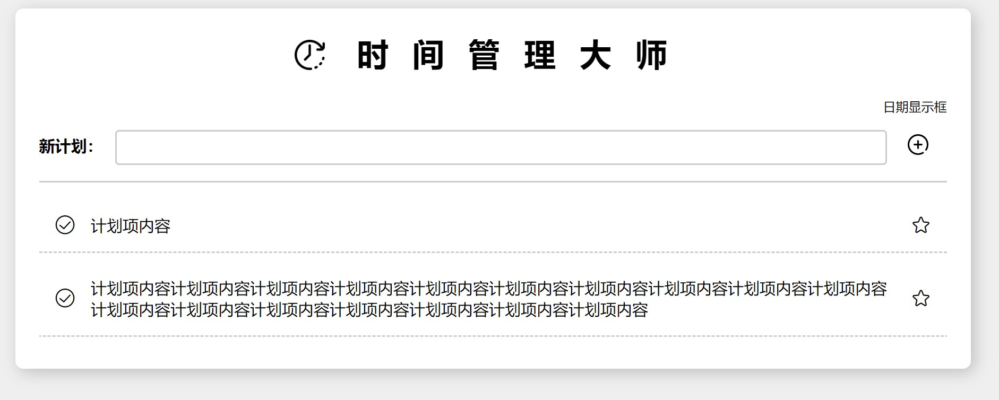

# <font color=#cc3333>⏰ 时间管理</font>大师<br><font size=3 color=grey>携程前端训练营&nbsp;&nbsp;&nbsp;&nbsp;HTML+CSS+JS 练习 </font><font size=3 color=grey>&nbsp;&nbsp;&nbsp;&nbsp;姓名：宣正吉 </font>

###### 😄 打开 main.html 并全部完成计划（点击所有计划前的对勾并划掉）有惊喜，默认一个样例

---

### 需求分析&知识点

##### 基础功能

1. 能够显示当前日期（Date 对象相关，需要进行日期的格式化）
2. 在输入框内写下计划，并按回车可添加计划到列表（表单、对象的创建和添加、模板字符串、点击和键盘事件）
3. 计划列表中每项可通过点击完成的形式移动到列表末尾并标记删除（字体图标和对象的删除、添加、事件委托、自定义属性）
4. 计划列表中的项目可收藏（拟添加良好的交互效果或动画）

##### 拓展功能

1. 日期时钟动态更新（定时器）
2. 删除计划项功能，鼠标移入显示删除按钮（删除节点、事件委托）
3. 能够设置计划时间段（表单）
4. 添加计划分类标签下拉菜单，并显示在计划项上（表单）
5. 每次点击完成时判断，计划全部完成在左上角添加一个喝彩表情包（元素遍历）
6. 清空全部按钮（删除节点、元素遍历、计时器）

### 文件组织

main.png 是标题前的 LOGO，由于图片文件比较少就没有放置在同一文件夹内。

> css:
>
> - base.css 文件内为清除默认样式和设置初始化样式
> - main.css 文件为主界面的样式
>   animate.css 第三方动画库，用于设计交互动画
>
> js:
>
> - main.js 文件内为主界面交互的逻辑代码
>
> fonts: 存放需要使用的矢量图标

### 界面设计

拟设计宽为 1200px 的居中面板，背景设为灰色，风格为黑白简约，添加圆角和阴影。设计界面时添加样例项占位，面板高度随计划项的数目变化而改变。

##### HTML 元素

由于 HTML 元素默认具有 padding、margin 等默认样式，通过以下代码能够去除这些默认样式：

```css
/* 去除所有元素的默认边距 */
* {
  margin: 0;
  padding: 0;
}
/* 去除列表项圆点*/
ul li {
  list-style: none;
}
/* 去除链接默认的下划线和颜色 */
a {
  text-decoration: none;
  color: black;
}
/* 去除输入框边框 */
input {
  outline: none;
  /* 行内元素居中对齐 */
  vertical-align: middle;
}
/* 图像大小和父元素一样 */
img {
  height: 100%;
  width: 100%;
}
```

其应于 main.css 之前采用 link 标签引用，否则会覆盖已经写好的自定义样式：

```html
<!DOCTYPE html>
<html lang="en">
  <head>
    <meta charset="UTF-8" />
    <meta http-equiv="X-UA-Compatible" content="IE=edge" />
    <meta name="viewport" content="width=device-width, initial-scale=1.0" />
    <link rel="stylesheet" href="./css/base.css" />
    // 先引用
    <link rel="stylesheet" href="./css/main.css" />
    // 后引用
    <title>时间管理大师</title>
  </head>
  <body></body>
</html>
```

界面中 HTML 元素的搭建，其中用到 HTML5 中的语义化标签区分头部与主体部分。其中主体部分输入框可以添加一个按钮，用于鼠标点击添加新项目，鼠标 hover 时图标可设计旋转 90° 放大以作强调：

```html
<body>
  <!-- 主界面面板 -->
  <div class="pannel">
    <!-- 标题和日期显示部分 -->
    <header>
      <h1>时间管理大师</h1>
      <p class="date">日期显示框</p>
    </header>
    <!-- 主体部分，输入框和列表 -->
    <main>
      <!-- 输入框部分 -->
      <div class="info">
        <span style="font-weight:700">新计划：</span>
        <input type="text" />
        <i class="add"></i>
      </div>
      <!-- 计划列表 -->
      <ul class="plans">
        <li class="plan-item">
          <div>
            <!-- 点击完成按钮 -->
            <span class="iconfont icon-kongxinduigou"></span>
            <p>计划项内容</p>
          </div>

          <!-- 点击收藏按钮 -->
          <span class="iconfont icon-shoucang"></span>
        </li>
      </ul>
    </main>
  </div>
</body>
```

##### CSS 样式

整个面板背景灰色，面板部分白色居中，不设高度，圆角形且带有阴影，高度变化用`transition`实现过渡动画：

```css
/* 整体背景色灰色 */
body {
  background-color: #efefef;
}
/* 面板，卡片风格，居中的圆角矩形，不设高度，有阴影 */
.pannel {
  margin: 20px auto;
  padding: 30px;
  width: 1200px;
  border-radius: 10px;
  box-shadow: 5px 5px 20px rgba(0, 0, 0, 0.2);
  box-sizing: border-box;
  font-size: 20px;
  background-color: #fff;
  /* color: #333; */
  transition: height 0.5s;
}
```

标题前有 LOGO 插入，采用伪元素 + 背景图的方式，图像在`<p></p>`标签的内容里，需要更改为 inline-block 类型，否则无法设置大小，时间显示在右上角，通过 float 布局实现：

```css
/* 标题部分，有文字间隔，居中 ----------------------------*/
.pannel header h1 {
  margin-bottom: 20px;
  padding-bottom: 20px;
  text-align: center;
  letter-spacing: 30px;
}
/* 标题之前的LOGO，行内块显示类型 */
.pannel header h1::before {
  position: relative;
  top: 5px;
  display: inline-block;
  margin-right: 40px;
  width: 38px;
  height: 38px;
  content: "";
  background-image: url(../main.png);
  background-size: contain;
}
/* 日期显示框，显示当前日期，在界面右上角小字标注 */
.date {
  /* 日期可以向上挪动一部分，较为美观 */
  margin-top: -10px;
  float: right;
  font-size: 16px;
}
```

输入框的大小和内部字体大小需要调整，激活时边框颜色加深可以通过`:focus`伪类来实现，一旁设有添加按钮，由于其鼠标滑过时有动画效果（`transition`属性实现），其设为具有背景的块元素：

```css
/* 输入框部分样式 ----------------------------------------*/
.pannel main .info {
  padding-top: 30px;
  padding-bottom: 20px;
  border-bottom: 2px solid #ccc;
}
.pannel main .info input {
  padding-left: 15px;
  margin-left: 10px;
  margin-right: 20px;
  height: 40px;
  width: 950px;
  font-size: 20px;
  border: 2px solid #ccc;
  border-radius: 5px;
  transition: all 0.5s;
}
/* 输入框激活边框加深 */
.pannel main .info input:focus {
  border: 2px solid #999;
}
/* 字体图标-添加 大小 */
.pannel main .info .add {
  display: inline-block;
  margin-bottom: -4px;
  width: 26px;
  height: 26px;
  background-image: url(../add.png);
  background-size: contain;
  cursor: pointer;
  transition: all 0.5s;
}
/* 悬浮添加按钮旋转90°带动画 */
.pannel main .info .add:hover {
  transform: rotate(90deg) scale(1.2);
}
```

计划项之间用下边框进行分割，类似于笔记本的效果，鼠标悬停强调将边框颜色设为白色，添加阴影，其也具有动画过渡效果。其中用 flex 布局实现列表项的分布和垂直方向的对齐：

```css
/* 计划项列表-------------------------------------------- */
.pannel main .plans {
  padding-top: 20px;
}
/* 计划项样式 */
.pannel main .plans .plan-item {
  display: flex;
  justify-content: space-between;
  align-items: center;
  padding: 20px 20px;
  margin-bottom: 10px;
  border-bottom: 2px dashed #ccc;
  /* background-color: pink; */
  border-radius: 10px 10px 0 0;
  transition: all 0.5s;
}
/* 悬浮阴影强调 */
.pannel main .plans .plan-item:hover {
  border-color: white;
  border-radius: 10px;
  box-shadow: 3px 3px 15px rgba(0, 0, 0, 0.2);
}

.pannel main .plans .plan-item p {
  padding-right: 20px;
  /* 禁止复制内容 */
  user-select: none;
}
.pannel main .plans .plan-item div {
  display: flex;
  align-items: center;
}
/* 两个图标的设置 */
.pannel main .plans .plan-item .iconfont:first-child {
  margin-right: 20px;
}
.pannel main .plans .plan-item .iconfont {
  font-size: 25px;
  cursor: pointer;
}
```

编写好的界面如下：


### 逻辑代码

为防止全局变量污染，在全局使用自调用函数。
首先日期需要显示在界面上，基础版本先不动态更新时间，这里仅显示一次程序运行时的本地时间，作为界面初始化操作：

```javascript
(function () {
  // 日期更新
  var date = new Date(); // 创建日期对象
  var year = date.getFullYear(); //年
  var month = date.getMonth(); //月
  var day = date.getDay(); //日
  var date_part = document.querySelector(".date");
  console.log(date_part);
  date_part.innerHTML = year + " 年 " + month + " 月 " + day + " 日 ";
})();
```

输入框内输入的内容在 value 属性中，点击右侧添加按钮可新建一个 li 对象，内部结构可以用模板字符串实现，仅替换内容部分即可：

```javascript
//   添加新项目
var add = document.querySelector(".add");
// 添加事件监听器
add.addEventListener("click", function () {
  // 获取输入框元素
  var input_area = document.querySelector("input");
  // 获取输入框内容
  var content = input_area.value;
  // 创建新li对象
  var new_li = document.createElement("li");
  // 为li添加其所属类
  new_li.classList.add("plan-item");
  // 填入li的内容
  new_li.innerHTML = `<div>
    <!-- 点击完成按钮 -->
    <span class="iconfont icon-kongxinduigou"></span>
    <p>
      ${content}
    </p>
  </div>
  <!-- 点击收藏按钮 -->
  <span class="iconfont icon-shoucang"></span>`;
  //   将li添加到ul
  var plan_list = document.querySelector("ul");
  plan_list.appendChild(new_li);
});
```

在添加新项目的同时最好清空输入框内容，且为添加按钮添加 enter 键按下事件，在其中触发一次添加按钮的 click 事件：

```javascript
// 清空输入框
input_area.value = "";
```

```javascript
this.addEventListener("keyup", function (e) {
  var add = document.querySelector(".add");
  // 按键输入
  if (e.code === "Enter") {
    // 触发click事件
    add.click();
  }
});
```

文本框输入内容不能为空，否则给予警告，连续的空格也视为空内容：

```javascript
if (content.trim() === "") {
  alert("输入内容不能为空！");
  return;
}
```

点击前面的勾选按钮表示完成计划，将计划项移动至列表末尾，且其内容需添加双划线（`text-decoration`属性实现），但是每添加一个新的计划时，都需要为其按钮添加点击事件，因此需要事件委托，在父元素 ul 上添加点击事件，并通过`target`属性实现，移到末尾后前面的勾选字体图标需要改变，实际上是改变 classList，而且可以在 classList 中删除添加和检测类实现图标点击切换：

```javascript
//   事件委托：点击勾选按钮和收藏按钮
var plan_list = document.querySelector("ul");
plan_list.addEventListener("click", function (e) {
  // console.dir(e.target.classList);
  if (e.target.classList[0] === "fin") {
    // 点击勾选按钮逻辑
    var target = e.target.parentNode.parentNode; // 获取点击的子元素li
    var child = target.children[0].children[0];
    // 如果该计划没完成
    if (child.classList[2] === "icon-kongxinduigou") {
      // 改变该子元素勾选按钮的类
      child.classList.remove("icon-kongxinduigou");
      child.classList.add("icon-duigou");
      // 将该子元素插入到末尾
      plan_list.appendChild(target);
      // 添加中划线
      // console.log(target.children[0].children[1].style);
      target.children[0].children[1].style.textDecoration = "line-through";
    } else {
      // 改变该子元素勾选按钮的类
      child.classList.remove("icon-duigou");
      child.classList.add("icon-kongxinduigou");
      // 将该子元素插入到开头
      // 如果只有一个元素不进行移动操作
      if (plan_list.children.length !== 1) {
        plan_list.insertBefore(target, plan_list.children[0]);
      }
      // 去掉中划线
      target.children[0].children[1].style.textDecoration = "none";
    }
  }
  if (e.target.classList[0] === "fav") {
    //点击收藏按钮逻辑
    console.dir(e.target.classList);
    //   交换类
    if (e.target.classList[2] === "icon-shoucang") {
      e.target.classList.remove("icon-shoucang");
      e.target.classList.add("icon-shoucang1");
    } else if (e.target.classList[2] === "icon-shoucang1") {
      e.target.classList.remove("icon-shoucang1");
      e.target.classList.add("icon-shoucang");
    }
    console.dir(e.target.classList);
  }
});
```

为了增加用户体验，这里我用第三方动画库 animate.css 设计交互动画，当点击收藏按钮时在其 classList 添加对应类，产生弹跳动画，取消则去除：

```javascript
//   事件委托：点击勾选按钮和收藏按钮
var plan_list = document.querySelector("ul");
plan_list.addEventListener("click", function (e) {
  // console.dir(e.target.classList);
  if (e.target.classList.contains("fin")) {
    // 点击勾选按钮逻辑
    var target = e.target.parentNode.parentNode; // 获取点击的子元素li
    var child = target.children[0].children[0];
    // 如果该计划没完成
    if (child.classList[2] === "icon-kongxinduigou") {
      // 改变该子元素勾选按钮的类
      child.classList.remove("icon-kongxinduigou");
      child.classList.add("icon-duigou");
      // 将该子元素插入到末尾
      plan_list.appendChild(target);
      // 添加中划线
      // console.log(target.children[0].children[1].style);
      target.children[0].children[1].style.textDecoration = "line-through";
    } else {
      // 改变该子元素勾选按钮的类
      child.classList.remove("icon-duigou");
      child.classList.add("icon-kongxinduigou");
      // 将该子元素插入到开头
      // 如果只有一个元素不进行移动操作
      if (plan_list.children.length !== 1) {
        plan_list.insertBefore(target, plan_list.children[0]);
      }
      // 去掉中划线
      target.children[0].children[1].style.textDecoration = "none";
    }
  }
  if (e.target.classList.contains("fav")) {
    //点击收藏按钮逻辑
    // console.dir(e.target.classList);
    //   交换类
    if (e.target.classList.contains("icon-shoucang")) {
      e.target.classList.remove("icon-shoucang");
      e.target.classList.add("icon-shoucang1");
      e.target.classList.add("animate__animated");
      e.target.classList.add("animate__bounceIn");
    } else if (e.target.classList.contains("icon-shoucang1")) {
      e.target.classList.remove("icon-shoucang1");
      e.target.classList.add("icon-shoucang");
      e.target.classList.remove("animate__animated");
      e.target.classList.remove("animate__bounceIn");
    }
    // console.dir(e.target.classList);
  }
});
```

同样使用该库还能实现添加新计划项的动画。

### 拓展功能

##### 实时时间显示

实时时间显示需要用`setInterval`等方法每隔 1s 刷新日期，可以写在最开始的部分，定时器自动执行，无需停止：

> **小错误：**
>
> - 这里我直接将代码写在定时器内，打开网页时会发生一秒钟闪烁，影响观感，需要将更新日期封装在函数中，初始调用一次可解决
> - 同时当时间长度小于 10 时需要在前面补零，用另外函数解决
> - Date 对象中，月份要+1，天不能用`getDay()`，其代表星期几，应该用`getDate()`

```javascript
// 日期更新
setDate();
function addZero(str) {
  if (str < 10) {
    str = "0" + str;
  }
  return str;
}
function setDate() {
  var date = new Date(); // 创建日期对象
  var year = date.getFullYear(); //年
  var month = date.getMonth() + 1; //月
  var day = date.getDate(); //日
  var hour = date.getHours(); //时
  var min = date.getMinutes(); //分
  var sec = date.getSeconds(); //秒
  var date_part = document.querySelector(".date");
  //   console.log(date_part);
  date_part.innerHTML =
    year +
    " 年 " +
    month +
    " 月 " +
    day +
    " 日 &nbsp;" +
    addZero(hour) +
    ": " +
    addZero(min) +
    ": " +
    addZero(sec);
}
setInterval(function () {
  setDate();
}, 1000);
```

##### 删除功能

鼠标移入计划项在收藏按钮旁显示删除按钮（淡出，用 `opacity` 实现）并显示动画，点击删除整个对象，仍通过事件委托的方式，html 与 css 在文件中可查看，下面是 js 逻辑部分：

```javascript
// 删除事件监听
if (e.target.classList.contains("del")) {
  // console.log("del");
  var li = e.target.parentNode; // 获取对应的点击对象li
  console.dir(li);
  // 播放动画
  li.classList.add("animate__animated");
  li.classList.remove("animate__zoomIn");
  li.classList.add("animate__zoomOut");
  setTimeout(function () {
    plan_list.removeChild(li);
  }, 300);
}
```

##### 设置计划时间段

添加一个时间表单选项，可以选择开始时间和结束时间，这里设置在一天 24 小时内，添加计划项后显示在左下角，添加完毕后先不清空，因为用户可能做连续的时间选择，每次都重复选择会麻烦，这里重新调整了布局分组：

```javascript
// 获取开始时间
var start_time = document.querySelector("#start").value;
var start_hour = start_time.slice(0, 2);
var start_min = start_time.slice(3);

// 获取结束时间
var end_time = document.querySelector("#end").value;
var end_hour = end_time.slice(0, 2);
var end_min = end_time.slice(3);
```

```javascript
// 创建新li对象
var new_li = document.createElement("li");
// 为li添加其所属类
new_li.classList.add("plan-item");
// 填入li的内容
new_li.innerHTML = `
    <div style="display: flex">
              <!-- 点击完成按钮 -->
              <span class="fin iconfont icon-kongxinduigou"></span>
              <div>
                <p>
                  ${content}
                </p>
                <!-- 计划时间段 -->
                <div class="plan-timeline">计划时间：${start_hour}:${start_min} ~ ${end_hour}:${end_min}</div>
              </div>
            </div>
              <!-- 删除按钮，移入显示 -->
              <span class="del iconfont icon-icon-cross-empty"></span>
              <!-- 点击收藏按钮 -->
              <span class="fav iconfont icon-shoucang"></span>
    `;
//   将li添加到ul
var plan_list = document.querySelector("ul");
plan_list.appendChild(new_li);
// 添加新计划项动画
new_li.classList.add("animate__animated", "animate__zoomIn");
// 清空输入框
input_area.value = "";
```

##### 计划类型的选择

在时间选择后添加一个下拉菜单，可选择任务标签，该任务标签在新增计划项时显示在右侧空白处，默认标签类型为无，程序设颜色列表，不同标签的颜色各异：

```html
<!-- 主体部分，输入框和列表 -->
<main>
  <!-- 输入框部分 -->
  <div class="info">
    <div>
      <span style="font-weight: 700; margin-left: 6px">新计划：</span>
      <input type="text" />
      <i class="add"></i>
    </div>
    <div style="font-weight: 700; font-size: 16px; margin: 20px 0 0 100px">
      开始时间：<input type="time" id="start" /> 结束时间：<input
        type="time"
        id="end"
      />
      标签：<select name="tags" id="tag">
        <option value="学习">学习</option>
        <option value="工作">工作</option>
        <option value="娱乐">娱乐</option>
        <option value="生活">生活</option>
        <option value="其它">其它</option>
      </select>
    </div>
  </div>
  <!-- 计划列表 -->
  <ul class="plans">
    <li class="plan-item">
      <div style="display: flex">
        <!-- 点击完成按钮 -->
        <span class="fin iconfont icon-kongxinduigou"></span>
        <div>
          <p>
            计划项内容计划项内容计划项内容计划项内容计划项内容计划项内容计划项内容计划项内容计划项内容计划项内容计划项内容计划项内容计划项内容计划项内容计划项内容计划项内容计划项内容
          </p>
          <!-- 计划时间段 -->
          <div class="plan-timeline">计划时间：3:00 ~ 5:00</div>
        </div>
      </div>
      <div class="tag-item">工作</div>
      <!-- 删除按钮，移入显示 -->
      <span class="del iconfont icon-icon-cross-empty"></span>
      <!-- 点击收藏按钮 -->
      <span class="fav iconfont icon-shoucang"></span>
    </li>
  </ul>
</main>
```

```javascript
// 获取任务类型
var color_list = {
  学习: "orange",
  工作: "skyblue",
  生活: "pink",
  娱乐: "purple",
  其它: "olivedrab",
};
var type = document.querySelector("#tag").value;
// console.log(type);

// 创建新li对象
var new_li = document.createElement("li");
// 为li添加其所属类
new_li.classList.add("plan-item");
// 填入li的内容
new_li.innerHTML = `
    <div style="display: flex">
              <!-- 点击完成按钮 -->
              <span class="fin iconfont icon-kongxinduigou"></span>
              <div>
                <p>
                  ${content}
                </p>
                <!-- 计划时间段 -->
                <div class="plan-timeline">计划时间：3:00 ~ 5:00</div>
              </div>
            </div>
            <div class="tag-item">${type}</div>
            <!-- 删除按钮，移入显示 -->
            <span class="del iconfont icon-icon-cross-empty"></span>
            <!-- 点击收藏按钮 -->
            <span class="fav iconfont icon-shoucang"></span>
    `;
// 修改标签颜色
new_li.querySelector(".tag-item").style.backgroundColor = color_list[type];
//   将li添加到ul
var plan_list = document.querySelector("ul");
plan_list.appendChild(new_li);
// 添加新计划项动画
new_li.classList.add("animate__animated", "animate__zoomIn");
// 清空输入框
input_area.value = "";
```

> **小错误：** 在添加新的计划项时，应该添加到最上方，否则当有计划完成时，新计划会被压在最底下。

##### 喝彩表情包

在整体框架左上角放置一个喝彩图片，起初透明度为 0，检查所有计划项是否都完成，如果都完成则将透明度设置为 1：

```javascript
if (e.target.classList.contains("fin")) {
  // 点击勾选按钮逻辑
  var target = e.target.parentNode.parentNode; // 获取点击的子元素li
  var child = target.children[0].children[0];
  // 如果该计划没完成，其中检查所有项目是否完成，完成显示表情包
  if (child.classList[2] === "icon-kongxinduigou") {
    // 改变该子元素勾选按钮的类
    child.classList.remove("icon-kongxinduigou");
    child.classList.add("icon-duigou");
    // 将该子元素插入到末尾
    plan_list.appendChild(target);
    // 添加中划线
    target.children[0].children[1].children[0].style.textDecoration =
      "line-through";
    // 检查项目是否全部完成
    var flag = 1;
    var all_li = document.querySelectorAll(".plan-item");
    for (let i = 0; i < all_li.length; i++) {
      // 对勾是空心证明没完成，直接结束循环
      if (
        all_li[i].querySelector(".fin").classList.contains("icon-kongxinduigou")
      ) {
        flag = 0;
        break;
      }
    }
    // 如果通过检查
    if (flag === 1) {
      document.querySelector(".cong").style.opacity = "1";
    } else {
      document.querySelector(".cong").style.opacity = "0";
    }
  } else {
    // 改变该子元素勾选按钮的类
    child.classList.remove("icon-duigou");
    child.classList.add("icon-kongxinduigou");
    // 将该子元素插入到开头
    // 如果只有一个元素不进行移动操作
    if (plan_list.children.length !== 1) {
      plan_list.insertBefore(target, plan_list.children[0]);
    }
    // 去掉中划线
    target.children[0].children[1].children[0].style.textDecoration = "none";
    document.querySelector(".cong").style.opacity = "0";
  }
}
```

##### 全部清除

ul 内部设置一个按钮，用于清空所有计划项，清空后表情包随即消失，这里计时器部分较难设置，ul 为空时需要结束计时器，其内还有一个暂停器，**<font color=#cc3333>（这里有没有更好的方法呢？）</font>**：

```javascript
// 清空按钮
var clear_but = document.querySelector(".clear");
clear_but.addEventListener("click", function () {
  var plan_list = document.querySelector("ul");
  //对所有li元素按下删除直到ul为空
  var timer = setInterval(function () {
    if (plan_list.querySelectorAll("li").length === 0) {
      clearInterval(timer);
    } else {
      // 播放动画
      plan_list.querySelectorAll("li")[0].classList.add("animate__animated");
      plan_list.querySelectorAll("li")[0].classList.remove("animate__zoomIn");
      plan_list.querySelectorAll("li")[0].classList.add("animate__zoomOut");
      setTimeout(function () {
        plan_list.removeChild(plan_list.querySelectorAll("li")[0]);
      }, 500);
    }
  }, 300);
  // 表情包消失
  document.querySelector(".cong").style.opacity = "0";
});
```
